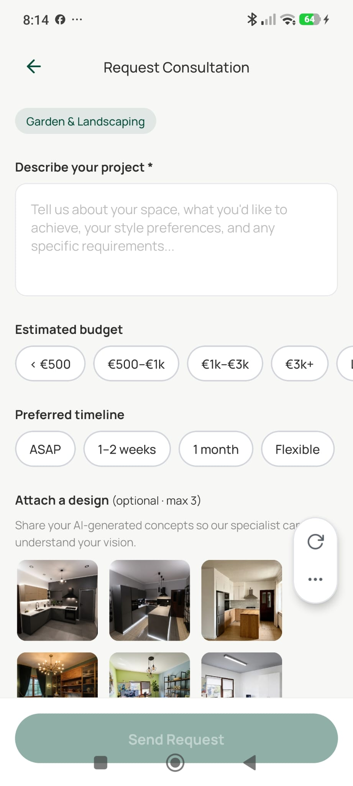

# Consultation Request Screen

**Source:** `app/assistant/request.tsx`  
**Purpose:** Pro users fill in a consultation request form: project description, budget, timeline, and optionally attach completed designs.

---

## Screenshot



---

## Layout

```
SafeAreaView
├── View — Header
│    ├── Pressable — ArrowLeft (back)
│    └── Text — "{Interior / Exterior / Garden} Design" (specialist label)
└── ScrollView
     ├── TextInput — Project description (multiline, "Describe your project…")
     ├── Text — "Budget"
     ├── View — Budget chip row
     │    └── Pressable chip × 5: [< €500] [€500–€1k] [€1k–€3k] [€3k+] [Let's discuss]
     ├── Text — "Timeline"
     ├── View — Timeline chip row
     │    └── Pressable chip × 4: [ASAP] [1–2 weeks] [1 month] [Flexible]
     ├── Text — "Attach Designs (optional, max 3)"
     ├── ScrollView horizontal — Completed design thumbnails (selectable)
     │    └── Pressable thumbnail × N (CheckCircle overlay when selected)
     └── Pressable — "Submit Request" (primary button, full width)
          └── ActivityIndicator during loading
```

---

## Components
- `TextInput` — multiline description field
- Budget / Timeline chips — pill-shaped, single-select with active state
- Design thumbnails — horizontal scroll, `CheckCircle` overlay on selected
- `Image` (expo-image) — design thumbnails
- `ArrowLeft`, `CheckCircle` icons

---

## Styles
| Element | Value |
|---|---|
| Background | `#F7F7F5` |
| Description input | White bg, `BorderRadius.md`, `minHeight: 120`, multiline |
| Budget/Timeline chips | `BorderRadius.full`, neutral bg → primary fill active |
| Design thumbnails | Square, `BorderRadius.sm`, `opacity: 0.5` unselected → 1.0 selected |
| CheckCircle overlay | Primary color, shown on selected thumbnail |
| Submit button | `#064E3B` fill, full width |

---

## Navigation
- ArrowLeft → back (to `/assistant/{type}`)
- "Submit Request" → creates consultation record + triggers admin email → back to Assistants tab
- Free users → redirected to `/paywall` on mount

---

## Design Notes
- Up to 3 designs can be attached (4th tap is ignored)
- Only `complete` designs with a result image are shown as options
- Admin is notified via `notify-consultation` edge function (Resend API)
- Budget and timeline are optional fields
