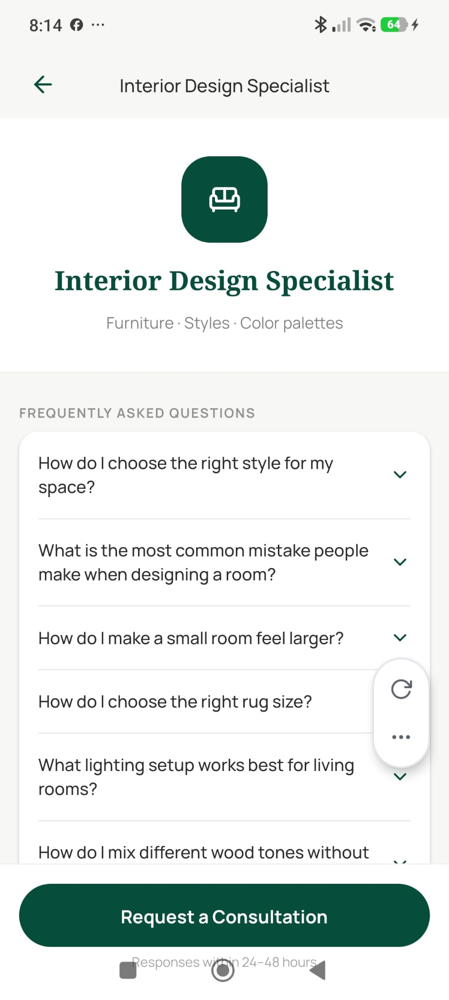
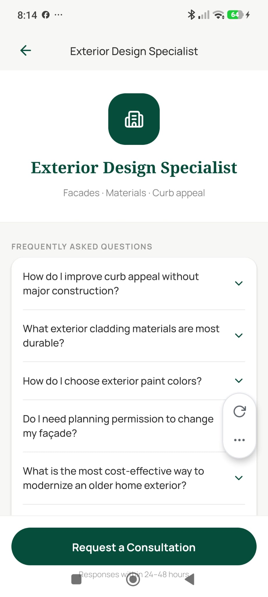
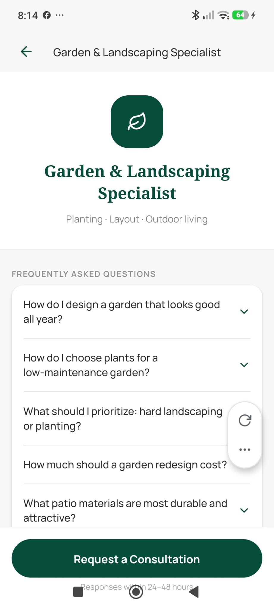

# Specialist Detail Screen

**Source:** `app/assistant/[type].tsx`  
**Purpose:** Detailed page for each specialist (Interior / Exterior / Garden) — shows Pro benefits, FAQ accordion, and a CTA to request a consultation.

---

## Screenshot





---

## Layout

```
SafeAreaView
├── View — Header
│    ├── Pressable — ArrowLeft (back)
│    └── [Specialist icon bubble — Sofa / Building2 / Leaf]
├── ScrollView
│    ├── View — Hero
│    │    ├── Text — specialist title
│    │    └── Text — specialist subtitle
│    ├── View — Pro benefits list (4 items)
│    │    └── [Icon + Text] × 4
│    │         (MessageSquare, FileText, Star, Clock — all gold #D4AF37)
│    ├── Text — "Frequently Asked Questions"
│    └── FAQItem × 10–12
│         ├── Pressable — question row (ChevronDown icon, animated rotation)
│         └── Animated.View — answer body (animated height + opacity)
└── View — Pinned CTA footer
     └── Pressable — "Request Consultation" (primary button)
          OR if not Pro: shows Lock icon + "Pro plan required"
```

---

## Components
- `FAQItem` — animated accordion with Reanimated (chevron rotation + height interpolation)
- `ChevronDown` — animated rotate to 180° when open
- `Sofa`, `Building2`, `Leaf` — specialist icon in header bubble
- `MessageSquare`, `FileText`, `Star`, `Clock` — Pro benefit icons (gold)
- `Lock` — shown in footer if not Pro

---

## Styles
| Element | Value |
|---|---|
| Background | `#F7F7F5` |
| Specialist icon bubble | Large (48px+), `#064E3B` bg, white icon |
| Hero title | Noto Serif Bold, large |
| Benefit icon color | `#D4AF37` (secondary / gold) |
| FAQ item | White card, `BorderRadius.md`, `elevation: 1` |
| FAQ question | Manrope Medium, `#2C2C2C` |
| FAQ answer | Manrope 400, 14px, `#2C2C2C` at 70% opacity |
| CTA button | `#064E3B` fill, full width, `paddingVertical: 16` |
| Pro-gate | Lock icon + muted text, no button |

---

## Navigation
- ArrowLeft → back (to Assistants tab)
- "Request Consultation" → `/assistant/request?type={type}` (Pro only)
- Non-Pro → redirected to `/paywall` on mount

---

## Design Notes
- FAQ is pre-written (10–12 Q&As per specialist type, zero AI cost)
- Each FAQ item animates open/close via Reanimated shared values
- Pro check happens via `fetchProfile` — free users are redirected to paywall
