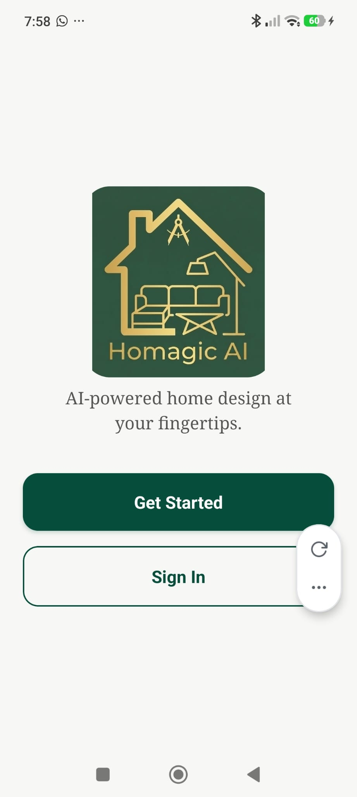

# Landing Screen

**Source:** `app/(auth)/index.tsx`  
**Purpose:** First screen the user sees — brand intro with two entry points (register or sign in).

---

## Screenshot



---

## Layout

```
SafeAreaView (neutral background #F7F7F5)
└── View (centered, paddingHorizontal: 24)
    ├── MotiView — Logo (animated: fade + scale + slide down)
    │    └── Image — logo.png (200×200, rounded corners 28px)
    ├── MotiView — Tagline (animated: fade + slide up, delay 600ms)
    │    └── Text — "AI-powered home design at your fingertips."
    └── View — Button container
         ├── MotiView — Primary button (animated, delay 1000ms)
         │    └── Pressable — "Get Started" → /(auth)/register
         └── MotiView — Secondary button (animated, delay 1200ms)
              └── Pressable — "Sign In" → /(auth)/login
```

---

## Components
- `MotiView` — entrance animations (fade, scale, translateY)
- `Image` (React Native) — logo asset
- `Pressable` — press scale animation (0.98×) on both buttons

---

## Styles
| Element | Value |
|---|---|
| Background | `#F7F7F5` (neutral) |
| Logo size | 200×200, `borderRadius: 28` |
| Tagline font | Noto Serif 400, 18px, `#2C2C2C` at 80% opacity |
| Tagline width | max 80% of screen |
| Tagline line height | 26px |
| "Get Started" button | `#064E3B` fill, white `Manrope 700` 18px, `borderRadius: 16`, `paddingVertical: 18` |
| "Sign In" button | Transparent, `#064E3B` border 1.5px, same font/size |
| Button gap | 16px |

---

## Navigation
- Arrives from: app launch (unauthenticated state)
- "Get Started" → `/(auth)/register`
- "Sign In" → `/(auth)/login`

---

## Design Notes
- All three elements animate in sequence: logo (0ms), tagline (600ms delay), buttons (1000ms / 1200ms delay)
- Buttons have both opacity and scale feedback on press
- No scroll — everything fits in one centered column
