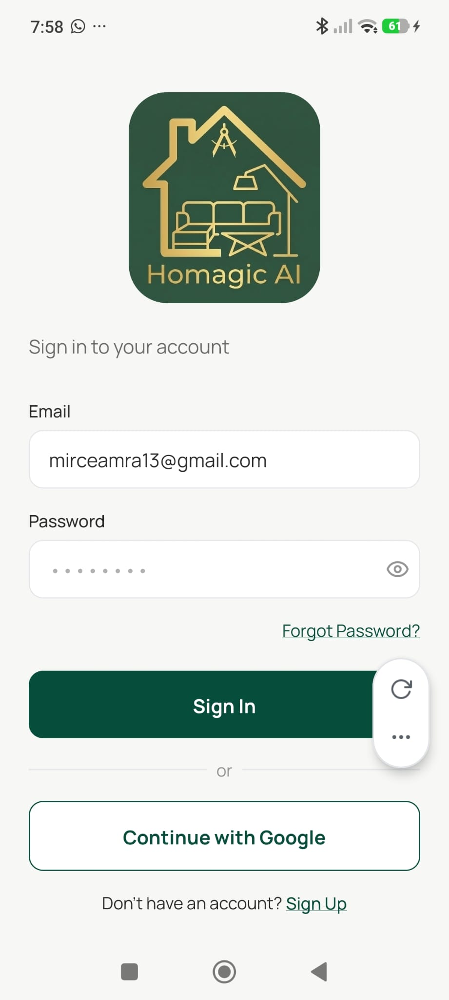

# Login Screen

**Source:** `app/(auth)/login.tsx`  
**Purpose:** Existing users sign in with email/password or Google OAuth.

---

## Screenshot



---

## Layout

```
SafeAreaView
└── KeyboardAvoidingView
    └── ScrollView (padding: 24, gap: 16)
        ├── Pressable — "← Back" → /(auth)
        ├── MotiView — Logo (160×176, rounded 32px, animated)
        ├── Text — "Sign in to your account" (subtitle)
        ├── ErrorBanner (conditional — shows auth errors)
        └── View (form, gap: 16)
             ├── InputField — Email
             ├── InputField — Password (Eye/EyeOff toggle)
             ├── Pressable — "Forgot Password?" (underline, right-aligned)
             ├── Pressable — "Sign In" (primary button)
             ├── View — "or" divider (line / text / line)
             ├── Pressable — "Continue with Google" (ghost button)
             └── View — "Don't have an account? Sign Up" (row)
```

---

## Components
- `InputField` — label above, error below, `rightElement` slot for Eye icon
- `ErrorBanner` — full-width red error bar (conditional)
- `Eye` / `EyeOff` from lucide-react-native — password toggle
- `ActivityIndicator` — replaces button text during loading

---

## Styles
| Element | Value |
|---|---|
| Background | `#F7F7F5` |
| Logo | 160×176, `borderRadius: 32` |
| Subtitle | Manrope 400, 16px, `#2C2C2C` at 70% opacity |
| Primary button | `#064E3B` fill, `BorderRadius.md` (12px), `paddingVertical: 16` |
| Ghost button | White fill, `#064E3B` border, same radius/padding |
| Forgot Password | Manrope 400, 14px, `#064E3B`, underline, right-aligned |
| Divider text | Manrope 400, 14px, 50% opacity |
| Sign Up link | Manrope 500, 14px, underline |

---

## Navigation
- "← Back" → `/(auth)` (landing)
- "Sign In" → `/(tabs)` (home) on success
- "Forgot Password?" → `/(auth)/forgot-password`
- "Sign Up" → `/(auth)/register`

---

## Design Notes
- Last used email is pre-filled from SecureStore on mount
- Keyboard avoidance via `KeyboardAvoidingView` (padding on iOS, height on Android)
- Both buttons show an `ActivityIndicator` spinner during loading and become 60% opacity
- Google sign-in triggers Supabase PKCE OAuth flow via `expo-web-browser`
