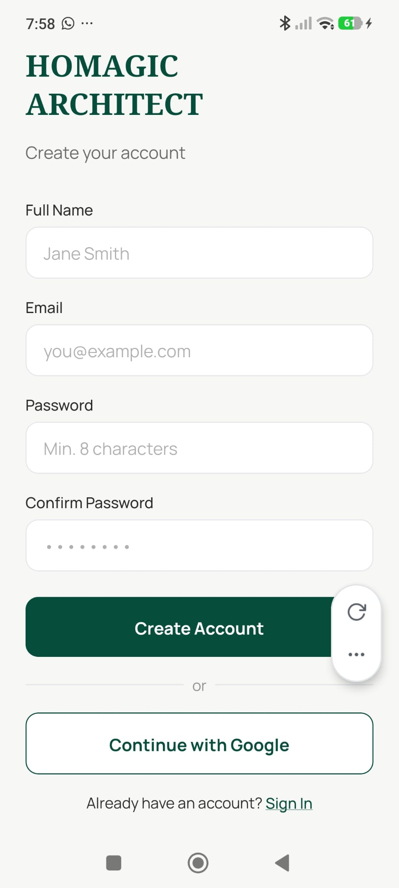

# Register Screen

**Source:** `app/(auth)/register.tsx`  
**Purpose:** New users create an account with name, email, and password (or via Google).

---

## Screenshot



---

## Layout

```
SafeAreaView
└── KeyboardAvoidingView
    └── ScrollView (padding: 24, gap: 16)
        ├── Pressable — "← Back" → /(auth)
        ├── Text — "HOMAGIC\nARCHITECT" (serif bold headline)
        ├── Text — "Create your account" (subtitle)
        ├── ErrorBanner (conditional)
        └── View (form, gap: 16)
             ├── InputField — Full Name
             ├── InputField — Email
             ├── InputField — Password (min 8 chars)
             ├── InputField — Confirm Password
             ├── Pressable — "Create Account" (primary button)
             ├── View — "or" divider
             ├── Pressable — "Continue with Google" (ghost button)
             └── View — "Already have an account? Sign In"
```

---

## Components
- `InputField` × 4 — each with label, error message, and appropriate `autoComplete`
- `ErrorBanner` — global form error display
- `ActivityIndicator` — loading state in both buttons

---

## Styles
| Element | Value |
|---|---|
| Background | `#F7F7F5` |
| Headline | Noto Serif Bold, 28px, `#064E3B`, `lineHeight: 36` |
| Subtitle | Manrope 400, 16px, `#2C2C2C` at 70% opacity |
| Primary button | `#064E3B`, `BorderRadius.md`, `paddingVertical: 16` |
| Ghost button | White fill, `#064E3B` border |

---

## Navigation
- "← Back" → `/(auth)`
- "Create Account" → `/(tabs)` on success
- "Sign In" → `/(auth)/login`
- "Continue with Google" → Google OAuth → `/(tabs)` on success

---

## Design Notes
- Validation runs on blur per field and again on submit
- Fields: name (required), email (format check), password (min 8 chars), confirm (must match)
- No logo image shown — replaced by the serif "HOMAGIC ARCHITECT" text headline
