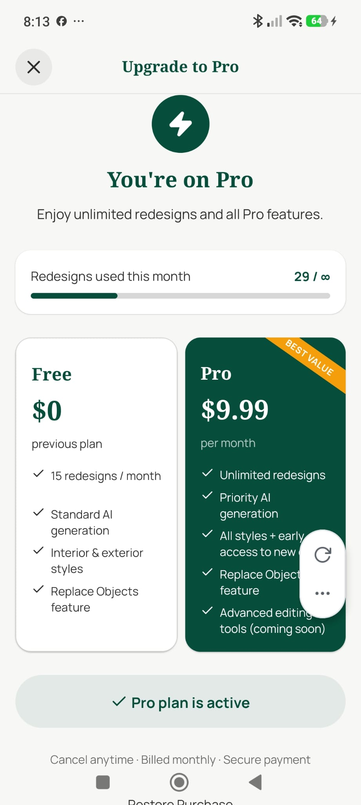

# Paywall / Upgrade Screen

**Source:** `app/paywall.tsx`  
**Purpose:** Converts free users to Pro — shows current usage, feature comparison, and purchase CTA.

---

## Screenshot



---

## Layout

```
View (full screen, paddingTop: safe area top)
├── View — Header
│    ├── Pressable — X (close)
│    └── Text — "Upgrade to Pro"
└── ScrollView (paddingBottom: safe area bottom + 32)
     ├── View — Hero
     │    ├── Zap icon (large, gold/primary)
     │    ├── Text — "Unlock Unlimited Redesigns"
     │    └── Text — "Transform every room in your home"
     ├── View — Usage bar
     │    ├── View — track
     │    │    └── View — fill (dynamic %)
     │    └── Text — "{used} of {limit} redesigns used this month"
     ├── View — Free vs Pro comparison
     │    ├── Column — Free (white card)
     │    │    ├── Header — "Free"
     │    │    └── Feature list (grey X or text)
     │    └── Column — Pro (dark green card)
     │         ├── Header — "Pro · €9.99/mo"
     │         └── Feature list (white Check icons)
     ├── [If pro already active]
     │    └── Text — "Pro plan is active"
     └── Pressable — "Upgrade Now" (primary, full width)
          └── ActivityIndicator during purchase
     └── Pressable — "Restore Purchase" (text link, centered)
```

---

## Components
- `Zap`, `Check` icons
- Usage progress bar — same component pattern as profile screen
- RevenueCat `purchaseProPlan()` — triggers in-app purchase
- `ActivityIndicator` — during purchase and restore

---

## Styles
| Element | Value |
|---|---|
| Background | White (`#FFFFFF`) |
| Header | Row with X and title |
| Zap icon | Large (40px), gold or primary color |
| Usage bar track | `#E5E7EB` |
| Usage bar fill | Dynamic — primary color, turns red when at limit |
| Free column | White bg, `BorderRadius.lg`, border |
| Pro column | `#064E3B` bg, white text, `BorderRadius.lg` |
| Pro header | Gold (`#D4AF37`) accent text or badge |
| Check icons | White on Pro column |
| Upgrade button | `#064E3B` fill, full width, `paddingVertical: 18` |
| Restore link | Manrope 400, 13px, muted, centered |

---

## Navigation
- X → `router.back()`
- "Upgrade Now" → RevenueCat purchase → success Alert → back
- "Restore Purchase" → RevenueCat restore → success/failure Alert

---

## Design Notes
- If user is already Pro, the upgrade button is hidden and a "Pro active" message shown instead
- `staleTime: 0` — always fetches fresh usage data on mount
- `userCancelled` errors from RevenueCat are silently swallowed (user dismissed payment sheet)
- Currently only available as a dev-build feature (RevenueCat requires a real build, not Expo Go)
