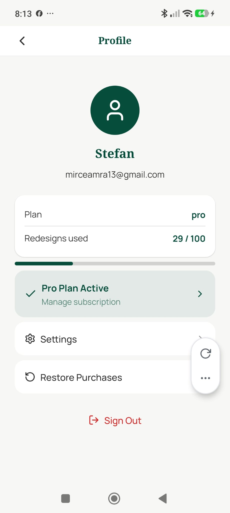

# Profile Screen

**Source:** `app/profile.tsx`  
**Purpose:** User account overview — shows name, email, plan, usage, and account actions.

---

## Screenshot



---

## Layout

```
SafeAreaView (edges: top)
├── View — Header
│    ├── Pressable — ChevronLeft (back)
│    ├── Text — "Profile"
│    └── View — spacer (40px)
└── View — Content (centered column)
     ├── View — Avatar circle (80×80, primary bg, User icon white)
     ├── Text — user full name (serif bold, 22px)
     ├── Text — user email (sans, muted)
     ├── View — Plan card (white, rounded)
     │    ├── Row — "Plan" / value
     │    ├── Divider
     │    └── Row — "Redesigns used" / "{used} / {limit}"
     ├── View — Usage progress bar
     │    └── View — fill bar (width = % used, primary color)
     ├── [If free plan] Pressable — Upgrade card
     │    ├── Zap icon (white)
     │    ├── "Upgrade to Pro" text
     │    └── ChevronRight
     ├── [If pro plan] Pressable — Pro active card
     │    ├── Check icon (primary)
     │    ├── "Pro Plan Active" + "Manage subscription"
     │    └── ChevronRight
     ├── Pressable — Settings row (Settings icon + "Settings" + ChevronRight) → /settings
     ├── Pressable — Restore row (RotateCcw icon + "Restore Purchases")
     └── Pressable — Sign Out row (LogOut icon + "Sign Out", destructive red)
```

---

## Components
- `User`, `ChevronLeft`, `LogOut`, `Zap`, `Check`, `ChevronRight`, `Settings`, `RotateCcw` icons
- Usage progress bar — custom `View` with dynamic fill width
- `ActivityIndicator` — shown during data loading

---

## Styles
| Element | Value |
|---|---|
| Background | `#F7F7F5` |
| Avatar | 80×80 circle, `#064E3B` bg, white icon |
| User name | Noto Serif Bold, 22px |
| User email | Manrope 400, 14px, muted |
| Plan card | White, `BorderRadius.lg`, `padding: 16`, `elevation: 1` |
| Usage bar track | `#E5E7EB`, `borderRadius: 4`, `height: 8` |
| Usage bar fill | `#064E3B`, dynamic width |
| Upgrade card | `#064E3B` bg, white text, `BorderRadius.md` |
| Pro active card | White bg, `#064E3B` border, `BorderRadius.md` |
| Settings/Restore rows | White bg, `BorderRadius.md`, icon + label + chevron |
| Sign Out | Red (`#DC2626`) text + icon |

---

## Navigation
- ChevronLeft → back
- Upgrade card → `/paywall`
- Settings row → `/settings`
- Sign Out → clears session → `/(auth)`

---

## Design Notes
- `staleTime: 0` on profile query — always fetches fresh data on mount
- Restore Purchases calls RevenueCat and updates Supabase if active subscription found
- Loading spinner fills the content area while data loads
