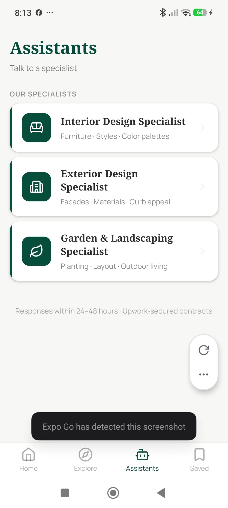

# Assistants Tab

**Source:** `app/(tabs)/assistants.tsx`  
**Purpose:** Directory of human design specialists — users can browse, read FAQs, and request consultations (Pro only).

---

## Screenshot



---

## Layout

```
SafeAreaView
├── View — Header
│    ├── Text — "Assistants" (serif bold, 28px)
│    └── Text — "Talk to a specialist" (subtitle)
└── ScrollView (padding: 16, paddingBottom: 48)
     ├── Text — "OUR SPECIALISTS" (section label, uppercase micro)
     ├── Pressable — Specialist card × 3 (Interior / Exterior / Garden)
     │    ├── View — 4px green left accent bar
     │    └── View — card inner (row)
     │         ├── View — Icon bubble (48×48, rounded, primary bg)
     │         │    └── [Sofa / Building2 / Leaf] icon (white)
     │         ├── View — Text block
     │         │    ├── Text — specialist title
     │         │    ├── Text — subtitle/description
     │         │    └── View — Status pill (conditional)
     │         └── ChevronRight icon
     ├── [If active consultations exist]
     │    ├── Text — "ACTIVE REQUESTS" (section label)
     │    └── Pressable — Consultation row × N
     │         ├── View — Icon circle (Clock / CheckCircle / MessageSquare)
     │         ├── View — Title + date
     │         └── View — Status pill
     └── View — Footer note ("Responses within 24–48 hours · Upwork-secured contracts")
```

---

## Components
- `Sofa`, `Building2`, `Leaf`, `ChevronRight`, `Clock`, `CheckCircle`, `MessageSquare` icons
- Status pill — dynamic color based on consultation status

---

## Status System
| Status | Label | Pill bg | Pill text |
|---|---|---|---|
| `pending` | Pending Review | `#FEF3C7` | `#92400E` |
| `reviewing` | Under Review | `#EFF6FF` | `#1D4ED8` |
| `proposal_sent` | Proposal Ready | `#FFFBEB` | `#D4AF37` |
| `accepted` | Accepted | `#ECFDF5` | `#065F46` |
| `declined` | Declined | `#F3F4F6` | `#6B7280` |

---

## Styles
| Element | Value |
|---|---|
| Background | `#F7F7F5` |
| Header title | Noto Serif Bold, 28px, `#064E3B` |
| Section label | Manrope Bold, 11px, `#2C2C2C` at 50%, uppercase, letterSpacing: 1 |
| Specialist card | White bg, `borderRadius: 16`, `elevation: 3`, left accent 4px `#064E3B` |
| Icon bubble | 48×48, `BorderRadius.md`, `#064E3B` bg |
| Card title | Noto Serif Bold, 16px, `#2C2C2C` |
| Card subtitle | Manrope 400, 12px, 55% opacity |
| Consultation row | White bg, `BorderRadius.md`, `paddingHorizontal: 16`, `paddingVertical: 12` |
| Consultation icon circle | 32×32, `BorderRadius.full`, `#F7F7F5` bg |
| Footer note | Manrope 400, 12px, 40% opacity, centered |

---

## Navigation
- Specialist card → `/assistant/{type}` (interior / exterior / garden)
- Active consultation row → `/assistant/proposal/{id}`

---

## Design Notes
- Declined consultations are filtered out of both sections
- A specialist card can show a status pill if there's an active consultation for that type
- "Active Requests" section only renders if there are active (non-declined) consultations
