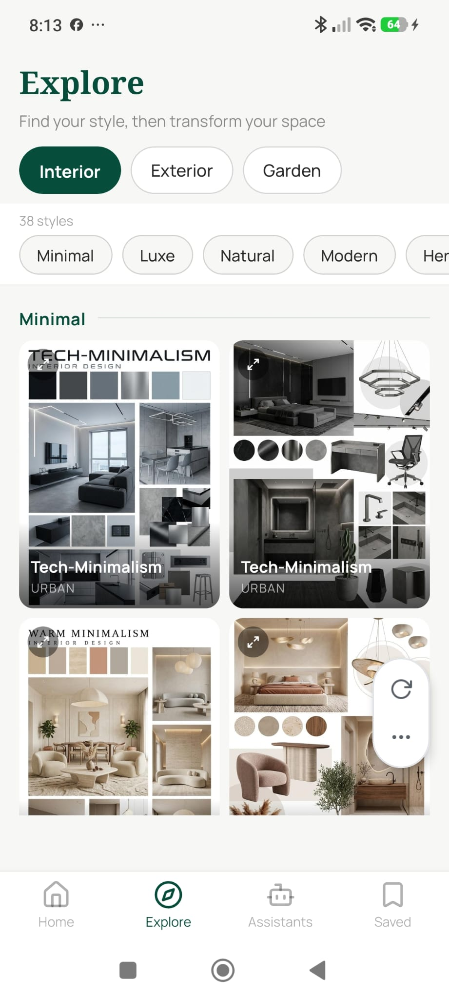

# Explore Tab

**Source:** `app/(tabs)/explore.tsx`  
**Purpose:** Style inspiration browser — browse all 80+ styles across Interior, Exterior, and Garden categories. Tapping a card starts the generation wizard.

---

## Screenshot



---

## Layout

```
SafeAreaView
├── View — Header
│    ├── Text — "Explore" (serif bold, 26px)
│    └── Text — "Find your style, then transform your space" (subtitle)
├── View — Category pill chips (Interior / Exterior / Garden)
├── View — Group chips row + style count
│    ├── Text — "{N} styles" (micro label)
│    └── ScrollView horizontal — group sub-chips
└── ScrollView (main grid)
     └── For each style group:
          ├── View — Section header (group label + horizontal line)
          └── View — 2-column card grid
               └── ExploreCard × N
                    ├── Image (full bleed, 3:4 aspect)
                    ├── Pressable — expand button (top-left, Maximize2 icon)
                    ├── LinearGradient overlay (bottom gradient)
                    │    ├── Text — style name
                    │    └── Text — mood (uppercase, 80% opacity)
                    └── Modal — full-screen preview (on expand)
```

---

## Components
- `ExploreCard` (memoized) — image + gradient overlay + expand button
- `LinearGradient` — `transparent → rgba(0,0,0,0.68)` bottom overlay
- `Maximize2`, `X` icons — expand / close full-screen preview
- `Modal` — full-screen dark background image preview

---

## Styles
| Element | Value |
|---|---|
| Background | `#F7F7F5` |
| Header title | Noto Serif Bold, 26px, `#064E3B` |
| Header subtitle | Manrope 400, 13px, `#2C2C2C` at 55% opacity |
| Category chips | `BorderRadius.full`, white bg + `#2C2C2C` border → primary fill active |
| Group chips | `BorderRadius.full`, neutral bg → primary fill active, smaller (14px/6px pad) |
| Style count | Manrope 400, 11px, 45% opacity |
| Card aspect ratio | 3:4 portrait |
| Card border radius | `BorderRadius.md` (12px) |
| Card style name | Manrope Bold, 13px, white |
| Card mood text | Manrope 400, 10px, white at 65% opacity, uppercase, letterSpacing: 0.8 |
| Expand button | 26×26 circle, `rgba(0,0,0,0.45)` bg, top-left corner |
| Section header | Manrope Bold, 14px, `#064E3B`, with flex line divider |
| Preview modal bg | `rgba(0,0,0,0.93)` |
| Preview image | 100% width, 75% height, contain fit |
| Close button | 40×40 circle, `rgba(255,255,255,0.15)`, top-right |

---

## Navigation
- Category chip → updates grid in place (no navigation)
- Group chip → scrolls to that section within the grid
- Card tap → `/explore/create?category={cat}&styleSlug={slug}`
- Expand button → opens full-screen preview Modal (no navigation)

---

## Design Notes
- Card grid is 2 columns, gap 8px, horizontal padding 16px
- Interior category has `_b` variant cards (38 total from 19 base styles)
- Section offsets are tracked via `onLayout` for jump-scroll on group chip tap
- `ScrollView` scrolls to y=0 when category changes
