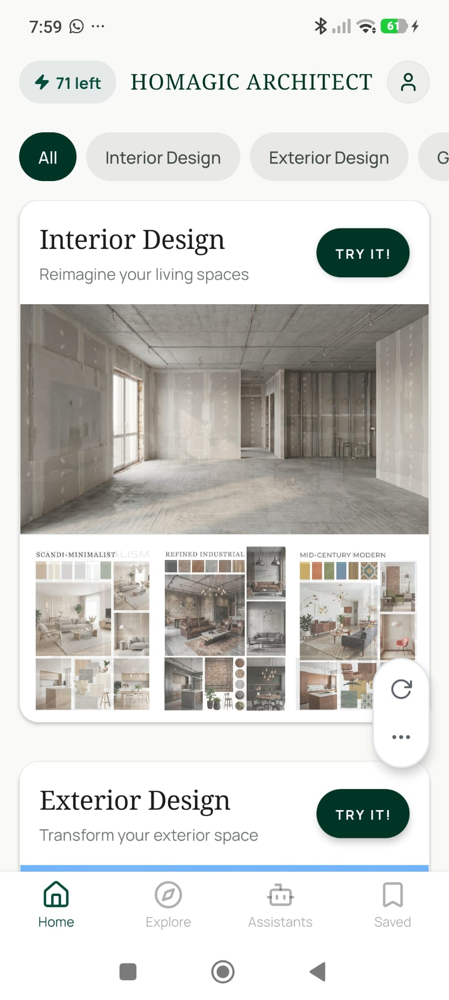

# Home Tab

**Source:** `app/(tabs)/index.tsx`  
**Purpose:** Main discovery feed — shows all three design categories with animated before/after banners and rotating moodboard thumbnails.

---

## Screenshot



---

## Layout

```
SafeAreaView (edges: top)
├── View — Header row
│    ├── Pressable — Credits pill (Zap icon + "{N} left") → /paywall
│    ├── Text — "HOMAGIC ARCHITECT" (serif, center)
│    └── Pressable — Avatar button (User icon, circular) → /profile
├── Pressable — Warning banner (conditional, amber) → /paywall
│    └── AlertTriangle icon + warning text
├── ScrollView — Horizontal filter chips
│    └── [All] [Interior Design] [Exterior Design] [Garden Design]
└── ScrollView — Discovery feed
     ├── Feed card — Interior Design
     │    ├── Header: title + subtitle + "TRY IT!" pill → /project/new
     │    ├── BannerAnimated (16:9 aspect, before/after crossfade)
     │    └── Moodboard row (3 thumbnails, 3:4 aspect, rotate every 4s)
     ├── Feed card — Exterior Design → /project/exterior
     ├── Feed card — Garden Design → /project/garden
     ├── Feature card — Replace Objects → /replace
     └── Feature card — Floor Restyle → /project/new
```

---

## Components
- `BannerAnimated` — animated before/after crossfade (`beforeSource` + `afterSource` props)
- `Image` (expo-image) — moodboard thumbnails with 600ms crossfade transition
- `Pressable` with pill shape — "TRY IT!" button
- `Zap`, `User`, `AlertTriangle` icons (lucide)

---

## Styles
| Element | Value |
|---|---|
| Background | `#F9F9F7` |
| Header height | ~52px (paddingVertical: 8) |
| Header title | Noto Serif 400, 18px, `#003526`, letterSpacing: 0.5 |
| Avatar button | 36×36 circle, `#eeeeec` bg |
| Credits pill | `BorderRadius.full`, dynamic bg color (green/amber/red based on remaining) |
| Credits pill text | Manrope Bold, 13px |
| Warning banner | `#fef3c7` bg, `#fde68a` border-bottom, `#92400e` text |
| Filter chip | `#e8e8e6` bg → `#003526` active |
| Filter chip text | Manrope Medium, 14px |
| Feed card | White bg, `borderRadius: 16`, `elevation: 2`, `borderColor: rgba(191,201,196,0.15)` |
| Card header title | Noto Serif 400, 22px, `#1a1c1b` |
| Card header subtitle | Manrope 400, 13px, `#707975` |
| "TRY IT!" button | `#003526` fill, `BorderRadius.full`, Manrope Bold 11px uppercase, letterSpacing: 1.5 |
| Banner aspect ratio | 16:9 |
| Moodboard thumbnails | 3:4 aspect, `borderRadius: 6` |

---

## Navigation
- Credits pill → `/paywall`
- Avatar → `/profile`
- Warning banner → `/paywall`
- "TRY IT!" on Interior card → `/project/new`
- "TRY IT!" on Exterior card → `/project/exterior`
- "TRY IT!" on Garden card → `/project/garden`
- "TRY IT!" on Replace Objects → `/replace`

---

## Design Notes
- Moodboard thumbnails auto-rotate every 4 seconds using `setInterval`
- Filter chips hide/show cards without navigating — purely local state
- Credits pill color changes dynamically: green (OK), amber (≤5 left), red (0 left)
- Warning banner only appears when ≤2 redesigns remain
- Feed has `paddingBottom: 120` to clear the tab bar
