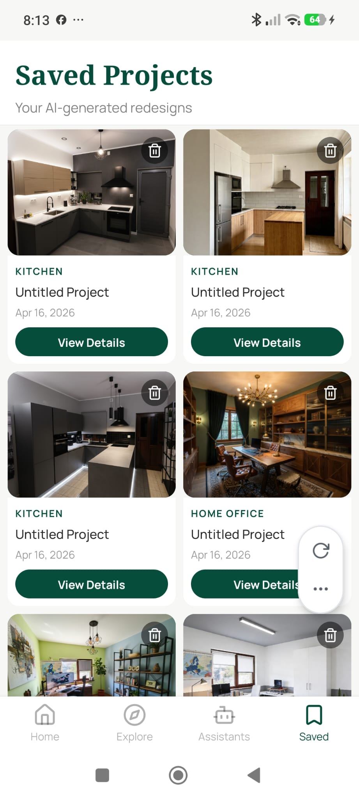

# Saved Tab

**Source:** `app/(tabs)/saved.tsx`  
**Purpose:** Unified gallery of all completed redesigns and object replacements, merged and sorted newest-first.

---

## Screenshot



---

## Layout

```
SafeAreaView (edges: top)
├── View — Header
│    ├── Text — "Saved Projects" (serif bold, 28px)
│    └── Text — "Your AI-generated redesigns" (subtitle)
└── [Loading state] ActivityIndicator
    OR
    [Error state] error text + Retry button
    OR
    [Empty state] "No saved designs yet" + subtext
    OR
    ScrollView — 2-column grid
         └── 50%-width card for each item
              ├── SavedCard (design) OR ReplacementCard
              │    ├── View — Image area (4:3 aspect)
              │    │    ├── Image OR loading overlay OR error overlay
              │    │    └── Pressable — Delete button (Trash2, top-right)
              │    └── View — Card body
              │         ├── Text — room type (uppercase badge)
              │         ├── Text — project title
              │         ├── Text — date
              │         └── Pressable — "View Details" button (conditional)
```

---

## Components
- `SavedCard` — design card with status-aware display
- `ReplacementCard` — replacement card with retry action
- `Trash2` icon — delete button (top-right overlay on image)
- `ActivityIndicator` — loading + "Generating…" / "Transforming…" overlay
- `Alert` — delete confirmation dialog

---

## Card States
| Status | Appearance |
|---|---|
| `complete` | Full result image, "View Details" button |
| `pending` / `processing` | Dark overlay + spinner + "Generating…" / "Transforming…" text |
| `failed` / `error` | Dark red (`#7f1d1d`) overlay + "Failed" text |

---

## Styles
| Element | Value |
|---|---|
| Background | `#F7F7F5` |
| Header bg | White, bottom border `#2C2C2C` at 15% |
| Header title | Noto Serif Bold, 28px, `#064E3B` |
| Header subtitle | Manrope 400, 14px, 60% opacity |
| Grid | `flexWrap: wrap`, each card = 50% width, `padding: 4` |
| Card image | 4:3 aspect, `#064E3B` bg (placeholder), `BorderRadius.md` |
| Card body | White bg, `BorderRadius.md` bottom corners, `padding: 8`, `gap: 4` |
| Room type badge | Manrope Bold, 10px, `#064E3B`, `letterSpacing: 1` |
| Project title | Manrope Medium, 13px |
| Date | Manrope 400, 11px, 50% opacity |
| "View Details" | `#064E3B` fill, `BorderRadius.full`, Manrope Bold 12px |
| Delete button | 28×28 circle, `rgba(0,0,0,0.5)`, top-right, zIndex 10 |
| Retry button | `#064E3B` fill, `BorderRadius.full` |

---

## Navigation
- Card tap → `/project/{projectId}` (for designs)
- Card tap → `/replace/result` with params (for replacements)
- Delete → Alert confirm → removes from DB + invalidates query

---

## Design Notes
- Feed merges designs + replacements sorted by `generated_at` / `created_at`
- `pending`/`processing` cards auto-poll every 3 seconds (React Query `refetchInterval`)
- Scroll content has `paddingBottom: 120` to clear the tab bar
- Empty state centered on screen with serif heading + muted subtext
